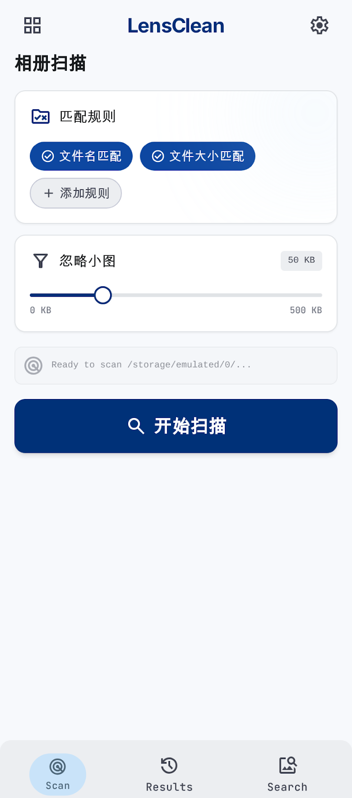

# 双影密探 ShadowSleuth — 智能相册清理

> 一款纯本地离线的 Android 重复图片查找工具，搜索快、体积小、不上传、让相册整理更安心。

---

## 项目简介

**双影密探 ShadowSleuth** 是一款面向 Android 用户的轻量化图库工具 APK。它无需联网、不后台上传，仅在本地通过「文件名」和「文件大小」两套规则，快速找出手机里的重复图片，并以分组对比的形式展示出来，方便你一眼判断哪些图片需要后续处理。

适合人群：
- 手机相册里图片太多，想快速找出重复/相似素材的用户
- 希望工具轻量、省电、不占用系统资源的用户
- 注重隐私，不愿把照片上传到云端分析的用户

---

## 核心功能

- **批量全局查重**：扫描 DCIM、截图、下载、社交应用保存图片、Pictures 等目录
- **三规则匹配**：按文件名、文件字节大小、dHash 差分哈希三套规则判定疑似重复
- **保存时间排除**：组内图片保存时间完全一致（精确到秒）时，不计入重复结果，减少误报
- **分组对比展示**：相同批次重复图分为一组，列表展示缩略图与元信息
- **单图定向检索**：从相册任选一张图片作为样本，全局找出同名、同大小或 dHash 相似的图片
- **dHash 相似检测**：差分哈希算法（汉明距离 ≤ 10），可发现经过轻微压缩/裁剪/格式转换的相似图片
- **dHash 性能优化**（v1.3.0）：分桶索引 + 滑动窗口，将 15000 张照片的扫描从 O(n²) ≈ 1.12 亿次比较降至 ~50 万次候选，速度提升约 **200 倍**，不再卡死
- **原图预览**：点击缩略图进入全屏原图查看，保留时间、大小等元信息
- **轻量过滤**：可忽略小于指定 KB 的极小图片，减少无效结果
- **手动触发扫描**：启动授权后不会自动扫描，用户点击「开始扫描」按钮才执行，避免不必要的资源占用
- **结果直接展示**：扫描完成后自动跳转到结果页，无需额外选择匹配规则
- **结果分类筛选**：结果页顶部提供「全部 / 文件名相同 / 文件大小相同 / dHash 相似」单选筛选，快速定位不同类型的重复项
- **图片 EXIF 详情**：主页「查看图片详细信息」可选择图片查看 EXIF 元信息（拍摄时间、设备、GPS、光圈、ISO 等）
- **关于与版权提示**：主页右上角信息按钮，展示项目 GitHub 链接、联系方式与版权提醒
- **长按操作**：长按图片项可查看详细信息或删除图片（删除前带确认弹窗）
- **主题切换**：支持浅色、深色、跟随系统三种模式，主题选择持久化保存

---

## 产品特点

- ⚡ **搜索快**：只读取必要元数据，不阻塞 UI
- 📦 **体积小**：原生优先、少依赖第三方库，安装包尽量精简
- 🔋 **省资源**：异步扫描、低内存占用、不后台常驻
- 🔒 **纯本地**：不上传任何图片，无网络请求
- 🛡️ **权限友好**：适配 Android 8 ~ 14，启动时请求读写权限，Android 10+ 提供完整存储权限开关入口

---

## 架构与搜索原理

### 整体架构

APP 采用轻量级原生架构，核心模块职责清晰：

| 模块 | 文件 | 职责 |
|------|------|------|
| **UI 层** | `ui/scan`、`ui/results`、`ui/search`、`ui/preview` | 展示扫描、结果、搜索、预览四个页面 |
| **扫描器** | `data/ImageScanner.kt` | 通过 `MediaStore` + `ContentResolver` 读取本地图片元数据 |
| **匹配器** | `data/DuplicateFinder.kt` | 按文件名 / 文件大小 / dHash 分组判定重复，并排除保存时间完全一致的组 |
| **哈希计算器** | `data/DHashCalculator.kt` | 差分哈希算法，将图片缩至 9×8 后计算 64-bit dHash，支持汉明距离比较 |
| **EXIF 读取器** | `data/ExifReader.kt` | 读取图片 EXIF 与尺寸信息 |
| **状态容器** | `viewmodel/ScanViewModel.kt` | 持有扫描状态、搜索状态，并处理删除逻辑 |
| **主题容器** | `ui/theme/ThemeViewModel.kt` | 持有浅色 / 深色 / 跟随系统主题模式 |
| **权限处理** | `MainActivity.kt` | 启动时请求读写权限，删除时处理系统授权对话框 |

```
用户点击「开始扫描」
    ↓
MainActivity 检查读取权限（Android 13+ 用 READ_MEDIA_IMAGES，旧版用 READ_EXTERNAL_STORAGE）
    ↓
ImageScanner 查询 MediaStore.Images.Media.EXTERNAL_CONTENT_URI
    ↓
提取元数据：ID、URI、文件名、大小、添加时间、分辨率、MIME 类型
    ↓
DuplicateFinder 按规则分组（文件名 / 大小），排除保存时间完全一致的组
    ↓
ScanViewModel 更新 ScanState.Complete
    ↓
自动跳转到 ResultsScreen 以分组卡片形式展示
    ↓
长按图片 → 查看详情 / 删除
```

### 搜索原理

1. **只读元数据**：扫描阶段不加载原图，只读取 `MediaStore` 提供的元数据。这避免了把大量图片解码到内存，显著降低内存占用和扫描时间。
2. **三规则匹配**：
   - **文件名相同**：`displayName.equals(..., ignoreCase = true)` 判定，适合找出同名重复下载/保存的图片。
   - **文件大小相同**：`sizeBytes` 完全一致。相同字节大小的图片极大概率是重复或高度相似的副本。
   - **dHash 相似**：差分哈希（Difference Hash）算法。将图片缩放到 9×8 后计算相邻像素的明暗差分，得到 64-bit 哈希值，两张图片汉明距离 ≤ 10 视为相似。可检测经过轻微压缩、裁剪或格式转换的相似图片。
3. **排除保存时间完全一致的组**：组内所有图片的 `dateAdded / 1000` 完全一致时，不视为重复组。
4. **过滤策略**：
   - 小于用户设定阈值（默认 50KB）的图片被忽略。
   - 宽或高为 `0` 的图片被视为无效/损坏元数据，不计入重复结果。
5. **单图搜索**：先扫描全库得到 `allImages`，然后以选中的样本图为基准，在全库中匹配同名或同大小的图片。

### 删除机制

- **Android 10+（API 29+）**：使用分区存储。
  - 推荐：开启 `MANAGE_EXTERNAL_STORAGE` 完整存储权限，删除无需二次确认。
  - 降级：删除 MediaStore 图片时若系统抛出 `RecoverableSecurityException`，APP 会启动系统提供的授权对话框，用户确认后再次执行删除。
- **Android 9 及以下**：启动时一并请求 `WRITE_EXTERNAL_STORAGE` 权限，获得后直接删除。
- 删除成功后，APP 会从内存状态和结果列表中移除该图片，无需重新扫描。

### 主题系统

- 使用 `DataStore` 持久化用户选择的主题模式（浅色 / 深色 / 跟随系统）。
- `ThemeViewModel` 通过 `StateFlow` 暴露当前模式。
- `MainActivity` 收集主题模式并传入 `ShadowSleuthTheme(...)`，主题切换立即生效。

---

## GitHub 仓库

- **仓库地址**: https://github.com/th2006464/ShadowSleuth.git
- 源码、APK 构建产物及后续版本迭代均会在此仓库维护。

## 快速开始

本项目为 Android APK，已完成源码开发与 Debug 构建：

- **源码**：`app/` 目录下，Kotlin + Jetpack Compose + Material 3
- **构建方式**：使用 Gradle Wrapper，`./gradlew assembleDebug`
- **APK 产物**：`app/build/outputs/apk/debug/app-debug.apk`（Debug 包，约 17 MB）
- **GitHub 直接下载**：[outputs/ShadowSleuth-v1.3.0.apk](https://github.com/th2006464/ShadowSleuth/blob/main/outputs/ShadowSleuth-v1.3.0.apk)
- **版本标签**：[v1.3.0](https://github.com/th2006464/ShadowSleuth/releases/tag/v1.3.0)（dHash 分桶索引性能优化）
- **构建环境**：OpenJDK 17 + Android SDK 34 + Gradle 8.2

### 本地构建

```bash
./gradlew assembleDebug
```

构建成功后 APK 位于 `app/build/outputs/apk/debug/app-debug.apk`。

### 注意

- 当前为 **正式版**，无 -debug 后缀。

---

## 更新日志

- **v1.3.0**（当前）：**dHash 分桶索引性能优化**
  - 🚀 **分桶索引算法**：8×8-bit 多级索引 + 滑动窗口，候选比较从 1.12 亿降至约 50 万次，速度提升约 **200 倍**
  - 🚀 **消除双重 openInputStream**：复用 MediaStore 已知宽高，15000 张照片省 15000 次跨进程文件打开
  - 🚀 **并发控制**：Semaphore 限制同时解码数（默认 16），避免 OOM
  - 🚀 **不阻塞主线程**：分桶 + 汉明距离比较在 Dispatchers.Default 运行
  - 🚀 **支持取消传播**：定期 yield()，用户可随时中断 dHash 扫描
  - 🚀 **结构化并发**：computeBatch() 批量计算使用 coroutineScope + async，取消时全部立即停止
  - 版本：versionCode=16，versionName=1.3.0

- **v1.2.4**（前版）：**扁平化正式版**
  - 🎨 全面 UI 重设计：采用现代化扁平设计风格，纯色块、大圆角、高对比度
  - 🧩 自定义组件库：替换所有系统 AlertDialog/ModalBottomSheet/FilterChip/FAB，统一设计语言
  - 新增：`SsComponents.kt` 组件库（Primary/Secondary/Danger/Outline/Ghost 按钮、FilterChip、Dialog、ActionSheet、FAB、Badge、EmptyState）
  - 优化：HeroCard 去渐变改用纯色块，导航栏自定义高亮选中态
  - 优化：关于弹窗、主题选择弹窗、详情弹窗、删除确认弹窗、底部操作表全面扁平化
  - 优化：PreviewScreen、DuplicateGroupCard、ImageListItem 扁平化重写
  - 优化：浅色/深色主题色板全面调整，对比度更强
  - 版本：versionCode=15，versionName=1.2.4

- **v1.1.0-debug** → 跳号（内部迭代）
  - dHash 缓存管理，结果统计信息，UI 微调

- **v1.0.9-debug**
  - 新增：dHash 差分哈希相似图片检测，算法：图片缩至 9×8 → 64-bit 差分哈希 → 汉明距离 ≤ 10 视为相似
  - 新增：结果页顶部「dHash 相似扫描」按钮，点击后后台计算全量 dHash 并追加相似分组
  - 新增：结果页过滤器新增「dHash 相似」选项，可单独筛选 dHash 相似结果
  - 新增：搜索页「dHash 相似搜索」按钮，选中样本后可进行 dHash 相似搜索，结果与文件名/大小结果合并展示
  - 规则：保存时间完全一致（精确到秒）的组不视为重复（与现有规则一致）
  - 新增：`data/DHashCalculator.kt` dHash 计算与汉明距离工具类
  - 版本：versionCode=9，versionName=1.0.9

- **v1.0.8-debug**
  - 新增：浅色 / 深色 / 跟随系统主题切换，使用 DataStore 持久化，系统深色时自动切换深色
  - 新增：扫描页右上角主题切换按钮
  - 优化：扫描页移除匹配规则选项，点击「开始扫描」后直接扫描并跳转到结果页
  - 优化：搜索结果页移除匹配规则选项，选择图片后直接按默认规则匹配
  - 新增：匹配结果排除保存时间完全一致（精确到秒）的组，减少误报
  - 优化：启动时大胆请求 `READ_MEDIA_IMAGES` / `READ_EXTERNAL_STORAGE` + `WRITE_EXTERNAL_STORAGE`
  - 新增：Android 10+ 提供 `MANAGE_EXTERNAL_STORAGE` 完整存储权限开关入口，开启后删除无需二次授权
  - 整理：新增 `docs/skills.md` 和 `docs/project-experience.md`，沉淀可复用技能与项目经验
  - 更新：README、架构文档、需求文档与文档导航

- **v1.0.7-debug**
  - 移除：按分辨率匹配规则及其相关 UI（效果不佳，易误报）
  - 新增：授权后不再自动扫描，用户点击「开始扫描」按钮才执行扫描
  - 新增：结果页顶部改为「全部 / 文件名相同 / 文件大小相同」单选筛选
  - 新增：主页「查看图片详细信息」按钮，可选择图片查看 EXIF 元信息（拍摄时间、设备、GPS、光圈、ISO 等）
  - 新增：主页右上角「关于」信息按钮，展示 GitHub 地址、微信联系方式与版权提醒
  - 依赖：引入 `androidx.exifinterface:exifinterface:1.3.7` 读取图片 EXIF

- **v1.0.6-debug**
  - 新增：深色专业主题，默认启用深色风格，界面更具专业感与神秘感
  - 新增：应用图标重新设计，融入放大镜元素，呼应「密探」搜索定位
  - 修复：长按删除图片时 Android 10+ 权限不足的问题，通过系统授权对话框引导用户确认
  - 修复：Android 9 及以下启动时一并请求 `WRITE_EXTERNAL_STORAGE`，确保删除可用
  - 修复：过滤掉分辨率 `0 × 0` 的无效图片，避免其被计入重复结果
  - 优化：更新 README，补充整体架构与搜索原理说明
  - 优化：清理项目无用文件，减小体积

- **v1.0.5-debug**
  - 新增：按图片分辨率（宽 × 高）匹配重复图片（已在 v1.0.7 中移除）
  - 新增：扫描页、搜索页新增「按分辨率匹配」选项（已在 v1.0.7 中移除）
  - 新增：结果页顶部新增筛选 Chip，可按文件名相同、文件大小相同、分辨率相同进行筛选（已改为单选「全部/文件名/大小」）
  - 新增：结果页下滑后，点击底部「结果」导航按钮自动回到顶部
  - 新增：结果页标题栏支持点击回到顶部，并增加回到顶部悬浮按钮
  - 修复：搜索结果页滑动后点击底部「扫描」按钮无法返回主页的问题
  - 优化：底部导航统一使用首页路由作为回退栈根节点，切换更稳定

- **v1.0.4-debug**
  - 新增：扁平化 UI，支持深色模式
  - 新增：重新设计 App 图标
  - 新增：结果页与搜索页长按图片项，弹出「详细信息」和「删除」菜单
  - 新增：图片详情弹窗，展示名称、大小、尺寸、格式、保存时间、路径
  - 新增：删除图片确认对话框，确认后删除并刷新结果
  - 优化：扫描页 Hero 卡片、缩略图、预览页布局

- **v1.0.3-debug**
  - 新增：启动 App 时立即请求相册权限
  - 新增：搜索页无权限时主动提示
  - 优化：扫描页匹配规则改用 Checkbox 勾选

- **v1.0.2-debug**
  - 新增：匹配结果改为列表式展示

- **v1.0.1-debug**
  - 修复：扫描页「忽略小于 X KB」拖动条无法拖动
  - 修复：搜索页选择图片后闪退（Android 10+ MediaStore.DATA 列缺失）
  - 优化：搜索图片读取增加 OpenableColumns 回退与异常保护

- **v1.0.0-debug**
  - 初始版本：完成扫描、结果、搜索、预览四个页面

---

## 文档导航

| 文档 | 说明 |
|------|------|
| [docs/requirements.md](docs/requirements.md) | 功能需求、非功能需求与明确不做 |
| [docs/design-system.md](docs/design-system.md) | 设计原则、颜色、字体、组件规范 |
| [docs/architecture.md](docs/architecture.md) | 技术架构、数据流、主题系统、权限模型与性能优化策略 |
| [docs/skills.md](docs/skills.md) | 项目沉淀的可复用技能、工作流程与踩坑经验 |
| [docs/project-experience.md](docs/project-experience.md) | 从 0 到 v1.0.8 的迭代经验、关键决策与后续方向 |
| [docs/shadowsleuth-android-skill.md](docs/shadowsleuth-android-skill.md) | WorkBuddy 技能文档副本，可用于 AI 后续快速迭代 ShadowSleuth |
| [prototypes/index.html](prototypes/index.html) | UI 原型页面导航 |

---

## 截图预览



---

## 相关文件

- `Readme.txt`：原始需求来源
- `DESIGN.md`：原始设计规范
- `CLAUDE.md`：AI 编码行为准则
- `code.html`：原始 Scan Dashboard 原型

---

*Last updated: 2026-06-24 (v1.3.0)*


