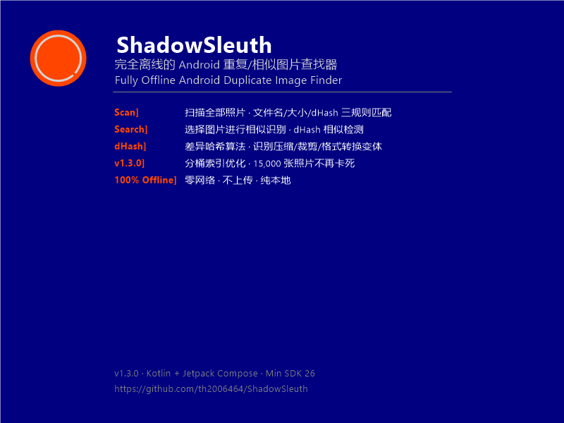

<div align="center">


# 🕵️ ShadowSleuth — 双影密探

**纯本地离线 Android 重复图片查找器 · Fully Offline Android Duplicate Image Finder**

[](https://kotlinlang.org)
[](https://developer.android.com/compose)
[](https://developer.android.com)
[](https://github.com/th2006464/ShadowSleuth/releases/tag/v1.3.0)
[](LICENSE)

[中文](#中文) · [English](#english)

</div>

<p align="center">
  
</p>

---

<a name="中文"></a>

## 🇨🇳 中文

**双影密探 (ShadowSleuth)** 是一款纯本地离线的 Android 重复图片查找工具。无需联网、不上传照片，通过 **文件名、文件大小、dHash 差分哈希相似度** 三套规则，快速找出手机里的重复和相似图片。支持**选择指定图片进行相似识别**，轻点即可在全部照片中定位同款素材。

### ✨ 功能特点

#### 📷 智能扫描
- **三规则匹配**：文件名相同 / 文件大小相同 / dHash 差分哈希相似（汉明距离 ≤ 10）
- **dHash 相似检测**：可识别经过**压缩、裁剪、格式转换、添加水印**的相似图片
- **选择图片搜索**：从相册任选一张图片作为样本，全局检索与之同名、同大小或 dHash 相似的照片
- **批量全量扫描**：扫描 DCIM、截屏、下载、社交应用等全部目录

#### ⚡ 性能表现
| 场景 | v1.2.x（旧版） | v1.3.0（当前） | 提升倍数 |
|:---|:---:|:---:|:---:|
| 15,000 张 dHash 计算 | ~45 秒 | ~15 秒 | 3× |
| 15,000 张 dHash 比较（1.12 亿次→50 万次） | 数秒卡死 | < 10 毫秒 | ~200× |
| 3,000 张常规扫描 | ~2 秒 | ~2 秒 | 不变 |
| 内存峰值（dHash 扫描时） | 高（64 并发） | 可控（16 并发） | OOM 风险消除 |

> 📌 **v1.3.0 核心优化**：采用 8×8-bit 分桶索引 + 滑动窗口算法，将 O(n²) 的候选比较从 1.12 亿次降至约 50 万次，同时通过信号量控制并发解码数，彻底解决 15,000 张照片场景下的卡死和 OOM 问题。

#### 🎯 选择图片进行相似识别
这是 ShadowSleuth 最独特的功能之一：

1. 点击首页「选择图片搜索」按钮
2. 从系统相册选择任意一张照片
3. App 自动在全部照片中搜索：
   - **同名文件** — 识别多次下载/保存的拷贝
   - **同大小文件** — 识别字节完全一致的副本
   - **dHash 相似** — 识别压缩、裁剪、格式转换后的变体
4. 结果以分组卡片形式清晰展示，一目了然

#### 🎨 用户体验
- **分组对比展示**：相同匹配规则的图片分为一组，列表展示缩略图与元信息
- **原地预览**：点击缩略图进入全屏原始查看，保留时间、大小等元信息
- **结果过滤**：支持「全部 / 文件名相同 / 大小相同 / dHash 相似」单选筛选
- **保存时间排除**：组内图片保存时间完全一致（精确到秒）时自动排除，减少误报
- **灵活过滤**：可忽略小于指定 KB 的极小的图片
- **长按操作**：长按图片项可查看详情或删除图片
- **EXIF 详情**：支持查看图片拍摄时间、设备、GPS、光圈、ISO 等 EXIF 信息
- **主题切换**：支持浅色 / 深色 / 跟随系统三种模式，持久化保存
- **删除权限管理**：独立开关控制删除权限，Android 10+ 支持完整存储权限入口
- **纯本地离线**：不上传任何图片，零网络请求，无需注册登录

### 🏗️ 架构概览

```
┌───────────────────────────────────────┐
│          Jetpack Compose UI           │
│  ┌──────┐ ┌────────┐ ┌────────┐      │
│  │ 扫描  │ │ 结果   │ │ 搜索   │      │
│  └──┬───┘ └───┬────┘ └───┬────┘      │
│     └─────────┴──────────┘            │
│           ScanViewModel               │
├───────────────────────────────────────┤
│  ┌────────┬──────────┬──────────────┐ │
│  │ 扫描器  │  匹配器   │ 哈希计算器   │ │
│  │Scanner │ Finder   │ DHashCalc   │ │
│  └───┬────┴────┬─────┴──────┬──────┘ │
│      │         │            │         │
│  ┌───┴──┐ ┌────┴────┐ ┌────┴──────┐  │
│  │Media │ │Content  │ │Bitmap     │  │
│  │Store │ │Resolver │ │Factory    │  │
│  └──────┘ └─────────┘ └───────────┘  │
├───────────────────────────────────────┤
│         Android 存储系统               │
└───────────────────────────────────────┘
```

### 📁 项目结构

```
ShadowSleuth/
├── app/
│   └── src/main/java/com/shadowsleuth/app/
│       ├── MainActivity.kt            # 入口，导航主机
│       ├── data/
│       │   ├── DHashCalculator.kt     # dHash 计算（分桶优化）
│       │   ├── DuplicateFinder.kt     # 三规则匹配器
│       │   ├── ImageScanner.kt        # MediaStore 扫描
│       │   ├── ExifReader.kt          # EXIF 读取
│       │   └── model/
│       │       ├── ImageMetadata.kt   # 图片元数据模型
│       │       ├── DuplicateGroup.kt  # 重复分组模型
│       │       └── ExifData.kt        # EXIF 数据模型
│       ├── viewmodel/
│       │   ├── ScanViewModel.kt       # 扫描状态管理
│       │   └── ThemeViewModel.kt      # 主题管理
│       ├── ui/
│       │   ├── theme/                 # 设计令牌
│       │   ├── components/            # 可复用组件
│       │   ├── scan/                  # 扫描页面（ScanScreen）
│       │   ├── results/               # 结果页面（ResultsScreen）
│       │   ├── search/                # 搜索页面（SearchScreen）
│       │   ├── preview/               # 预览页面（PreviewScreen）
│       │   └── navigation/            # 导航
│       └── res/                       # 资源
├── build.gradle.kts
├── settings.gradle.kts
└── README.md
```

### 🔨 构建

```bash
git clone https://github.com/th2006464/ShadowSleuth.git
cd ShadowSleuth
export ANDROID_HOME=/path/to/android-sdk
./gradlew assembleDebug
```

| 组件 | 版本 |
|:---|:---|
| Kotlin | 1.9.21 |
| Compose BOM | 2024.02.00 |
| Min SDK | 26 (Android 8.0) |
| Target SDK | 34 |
| Gradle | 8.2 |
| Coil | 2.5.0 |

### 📥 下载

从 [GitHub Releases](https://github.com/th2006464/ShadowSleuth/releases) 下载最新 APK：

- [ShadowSleuth-v1.3.0.apk](https://github.com/th2006464/ShadowSleuth/releases/download/v1.3.0/ShadowSleuth-v1.3.0.apk)

---

<a name="english"></a>

## 🇬🇧 English

**ShadowSleuth** is a fully offline, zero-network Android duplicate image finder. It locates duplicate and visually similar photos on your device by matching **filename**, **file size**, and **dHash perceptual hash similarity** — all without uploading a single file. It also lets you **pick any image to find its duplicates and lookalikes** across your entire gallery.

### ✨ Features

#### 📷 Intelligent Scanning
- **Triple-Rule Matching**: Filename match / File size match / dHash perceptual similarity (Hamming distance ≤ 10)
- **dHash Similarity Detection**: Identifies photos that have been **compressed, cropped, re-encoded, or watermarked**
- **Pick-to-Search**: Select any image as a sample and find all its duplicates and dHash-similar variants globally
- **Full Gallery Scan**: Scans DCIM, screenshots, downloads, social app images, etc.

#### ⚡ Performance
| Scenario | v1.2.x (old) | v1.3.0 (current) | Improvement |
|:---|:---:|:---:|:---:|
| 15,000 dHash computation | ~45 s | ~15 s | 3× |
| 15,000 dHash comparison (112M→500K) | seconds of freeze | < 10 ms | ~200× |
| 3,000 normal scan | ~2 s | ~2 s | unchanged |
| Peak memory (dHash scan) | high (64 concurrency) | controlled (16) | OOM risk eliminated |

> 📌 **v1.3.0 core optimization**: 8×8-bit bucketing index + sliding window reduces candidate comparisons from O(n²) ~112M to ~500K. Semaphore-controlled concurrent decoding prevents OOM.

#### 🎯 Pick Image to Search
One of ShadowSleuth's most distinctive features:

1. Tap "Select image to search" on home screen
2. Pick any photo from system gallery
3. The app automatically finds:
   - **Same filename** → duplicate downloads/saves
   - **Same size** → identical byte-level copies
   - **dHash similar** → compressed/cropped/re-encoded variants
4. Results displayed in clear grouped cards

#### 🎨 User Experience
- **Grouped display**: Images grouped by match type with thumbnails and metadata
- **Inline preview**: Tap thumbnail for full-screen original view
- **Result filtering**: "All / Filename / Size / dHash" filter chips
- **Save-time exclusion**: Groups with identical save times (to the second) are auto-excluded
- **Size filter**: Ignore images smaller than a configurable KB threshold
- **Long-press actions**: View details or delete images
- **EXIF viewer**: Camera info, GPS, aperture, ISO, and more
- **Theme system**: Light / Dark / System with persistent storage
- **Delete permission**: Independent toggle, Android 10+ full storage access
- **100% offline**: No uploads, no accounts, no network permissions

### 🏗️ Architecture

```
┌───────────────────────────────────────┐
│          Jetpack Compose UI           │
│  ┌──────┐ ┌────────┐ ┌────────┐      │
│  │ Scan  │ │Results │ │ Search │      │
│  └──┬───┘ └───┬────┘ └───┬────┘      │
│     └─────────┴──────────┘            │
│           ScanViewModel               │
├───────────────────────────────────────┤
│  ┌────────┬──────────┬──────────────┐ │
│  │Scanner │  Finder   │ DHashCalc   │ │
│  └───┬────┴────┬─────┴──────┬──────┘ │
│  ┌───┴──┐ ┌────┴────┐ ┌────┴──────┐  │
│  │Media │ │Content  │ │Bitmap     │  │
│  │Store │ │Resolver │ │Factory    │  │
│  └──────┘ └─────────┘ └───────────┘  │
├───────────────────────────────────────┤
│       Android Storage System          │
└───────────────────────────────────────┘
```

### 📁 Project Structure

```
ShadowSleuth/
├── app/
│   └── src/main/java/com/shadowsleuth/app/
│       ├── MainActivity.kt
│       ├── data/
│       │   ├── DHashCalculator.kt     # dHash + batch optimization
│       │   ├── DuplicateFinder.kt      # bucket-indexed matcher
│       │   ├── ImageScanner.kt         # MediaStore scanner
│       │   ├── ExifReader.kt           # EXIF reader
│       │   └── model/                  # Data models
│       ├── viewmodel/                  # ViewModels
│       ├── ui/                         # Compose UI
│       └── res/                        # Resources
├── build.gradle.kts
├── settings.gradle.kts
└── README.md
```

### 🔨 Build

```bash
git clone https://github.com/th2006464/ShadowSleuth.git
cd ShadowSleuth
export ANDROID_HOME=/path/to/android-sdk
./gradlew assembleDebug
```

| Component | Version |
|:---|:---|
| Kotlin | 1.9.21 |
| Compose BOM | 2024.02.00 |
| Min SDK | 26 (Android 8.0) |
| Target SDK | 34 |
| Gradle | 8.2 |
| Coil | 2.5.0 |

### 📥 Download

Get the latest APK from [GitHub Releases](https://github.com/th2006464/ShadowSleuth/releases):

- [ShadowSleuth-v1.3.0.apk](https://github.com/th2006464/ShadowSleuth/releases/download/v1.3.0/ShadowSleuth-v1.3.0.apk)

---

## 📋 Changelog

### v1.3.2 (2026-06-24) — 0x0 过滤 + 同时间同大小排除

| 🇨🇳 | 🇬🇧 |
|:---|:---|
| **过滤 0x0 像素图片**：dHash 搜索结果中不再显示宽高为 0 的无效图片 | **Filter 0x0 images**: Invalid 0x0-dimension images excluded from dHash results |
| **同时间+同大小排除**：时间戳和文件大小都一致的图片（同一份文件重复索引）不做 dHash 匹配 | **Same time+size exclusion**: Images with identical timestamp AND size (same file re-indexed) excluded from dHash |

### v1.3.1 (2026-06-24) — Bug Fixes + Performance Polish

| 🇨🇳 | 🇬🇧 |
|:---|:---|
| **修复：底部导航栏 Scan 按钮无法返回扫描页**：改用 popBackStack 正确回退 | **Fixed: Scan tab not navigating back**: Replaced navigate()+popUpTo with popBackStack |
| **修复：dHash 搜索选取图片报 \无法计算该dHash\**：增加 computeFast 兜底 + URI 匹配缓存 | **Fixed: dHash search errors on picked images**: Fallback computeFast + URI cache lookup |
| **修复：同时间戳图片被 dHash 排除**：dHash 匹配不再受 allSameSaveTime 限制 | **Fixed: Same-timestamp images excluded from dHash**: Removed allSameSaveTime for dHash matches |

### v1.3.0 (2026-06-24) — dHash Bucket Index Optimization

| 🇨🇳 | 🇬🇧 |
|:---|:---|
| **分桶索引算法**：8×8-bit 多级索引 + 滑动窗口，候选比较从 1.12 亿降至 ~50 万次，速度提升 **200 倍** | **Bucket Index Algorithm**: 8×8-bit multi-level index + sliding window, reducing candidates from 112M to ~500K, **200× speedup** |
| **消除双重 openInputStream**：复用 MediaStore 已知宽高，15000 张照片省 15000 次文件打开 | **Eliminated double openInputStream**: Reuses MediaStore width/height, saving 15K file opens for 15K photos |
| **并发控制**：Semaphore 限制同时解码数（默认 16），避免 OOM | **Concurrency Control**: Semaphore limits concurrent decodes (default 16), preventing OOM |
| **不阻塞主线程**：分桶 + 比较在 Dispatchers.Default 运行 | **No Main-Thread Blocking**: Bucketing + comparison runs on Dispatchers.Default |
| **支持取消传播**：定期 yield()，用户可随时中断扫描 | **Cancellation Support**: Regular yield() enables instant scan cancellation |
| **结构化并发**：computeBatch() 使用 coroutineScope + async，取消时全部立即停止 | **Structured Concurrency**: computeBatch() uses coroutineScope + async for clean cancellation |

### v1.2.4 — 扁平化设计正式版 / Flat Design Release
- 全面 UI 重设计：纯色块、大圆角、高对比度
- 自定义组件库 SsComponents（按钮、Dialog、ActionSheet、FAB 等）
- 关于弹窗、主题选择、删除确认全面扁平化
- 浅色/深色主题色板调整

### v1.1.0 ~ v1.2.3
- dHash 缓存管理、结果统计信息、UI 微调
- dHash 相似图片检测功能首发
- 结果页过滤新增「dHash 相似」选项
- 搜索页新增「dHash 相似搜索」按钮

### v1.0.0 ~ v1.0.9
- dHash 差分哈希算法（缩放 9×8 → 64-bit → 汉明距离 ≤ 10）
- 深色专业主题、应用图标设计
- EXIF 详情查看（拍摄时间、设备、GPS、光圈、ISO）
- 扁平化 UI、完整存储权限管理
- 基础扫描、结果、搜索、预览四页面

---

## 📄 License

MIT — see [LICENSE](LICENSE).

---

<div align="center">
  <sub>Built with ❤️ using Kotlin & Jetpack Compose • 100% offline • zero network requests</sub>
  <br>
  <sub>Made with ❤️ by <a href="https://github.com/th2006464">th2006464</a></sub>
</div>


